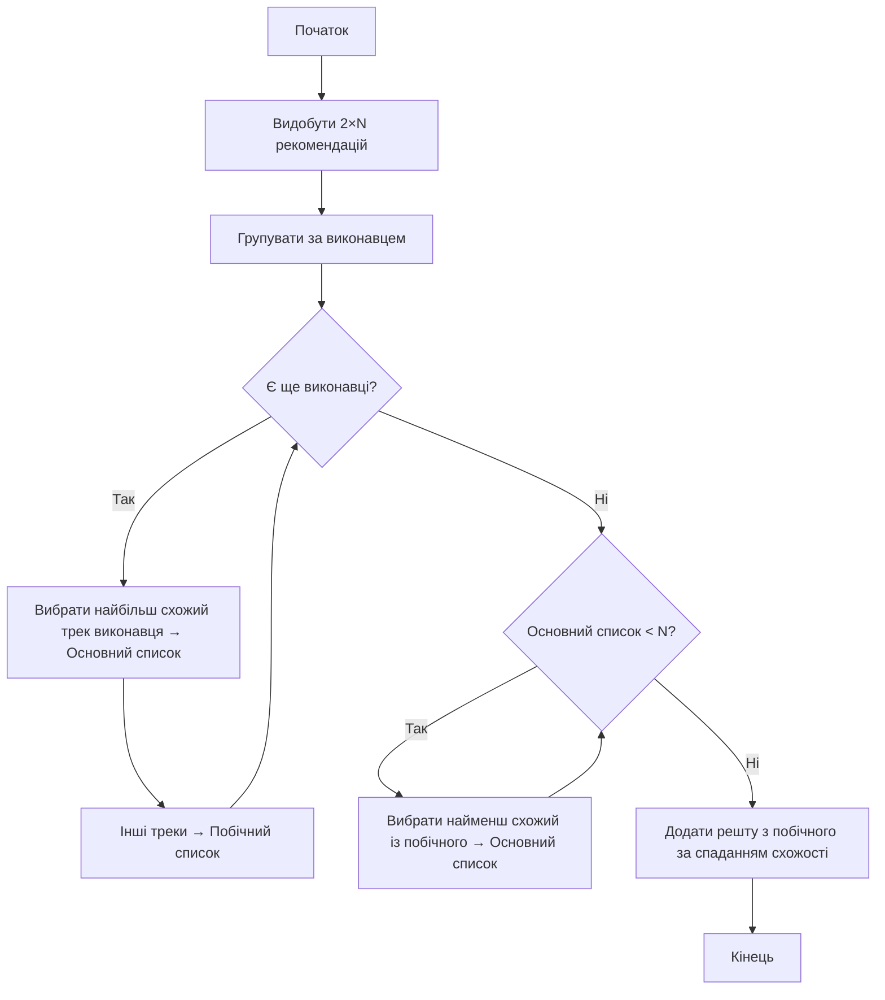

```mermaid
flowchart TD
  A[Початок] --> B[Видобути 2×N рекомендацій]
  B --> C[Групувати за виконавцем]
  C --> D{Є ще виконавці?}
  D -- Так --> E[Вибрати найбільш схожий трек виконавця → Основний список]
  E --> F[Інші треки → Побічний список]
  F --> D
  D -- Ні --> G{Основний список < N?}
  G -- Так --> H[Вибрати найменш схожий із побічного → Основний список]
  H --> G
  G -- Ні --> I[Додати решту з побічного за спаданням схожості]
  I --> J[Кінець]

```